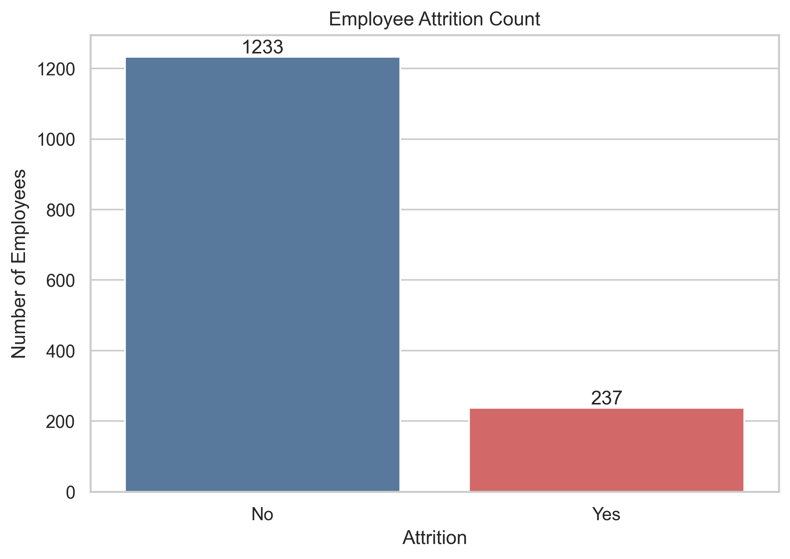
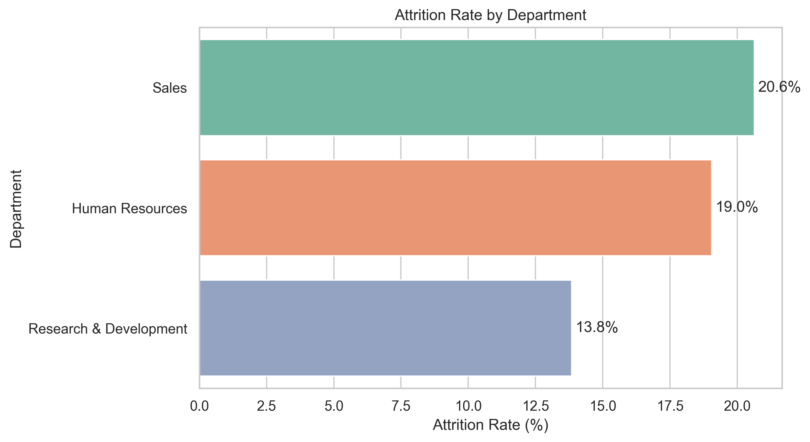
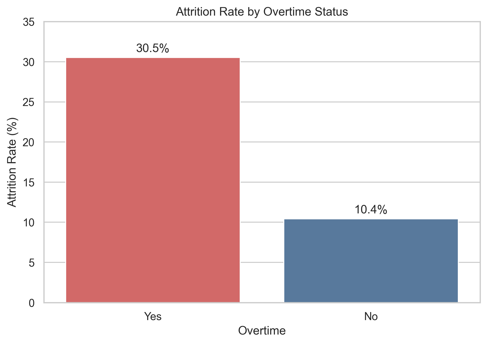
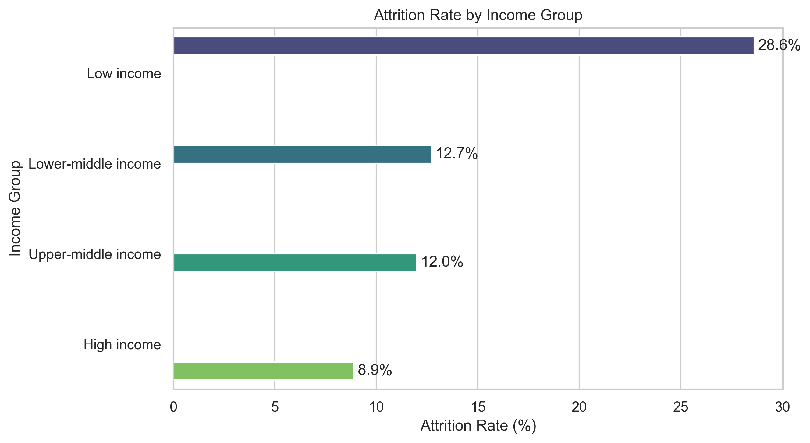
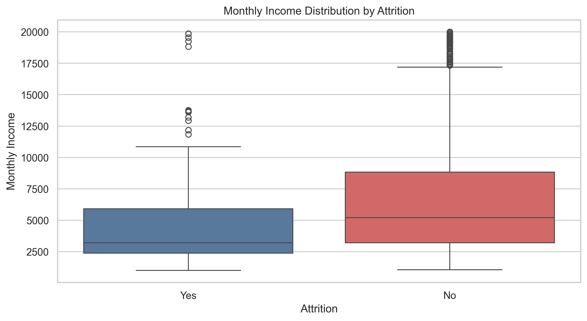
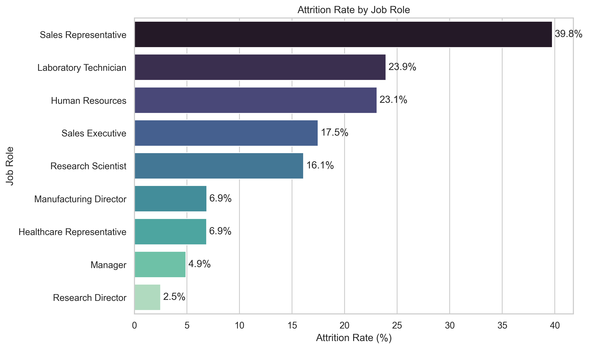

# 📊 Employee Attrition Analysis with Python


---

## 📌 Project Overview

An exploratory data analysis (EDA) project using Python and Jupyter Notebook to investigate employee attrition patterns within the IBM HR Analytics Attrition Dataset.

The project identifies key drivers of employee turnover, including overtime, income level, department, and job role. Through data cleaning, visualization, and statistical exploration, the analysis demonstrates how HR data can be transformed into actionable insights that support employee retention and workforce planning decisions.

> Built as part of a People Analytics portfolio to demonstrate Python-based data analysis, visualization, and business insight generation for HR Analyst, People Analyst, and Data Analyst roles.

---

## 📓 View the Notebook

| Option | Link |
|---|---|
| 🔍 NBViewer (Recommended) | [Open in NBViewer](https://nbviewer.org/github/joyceleehy/python-hr-attrition-eda/blob/main/notebooks/hr_attrition_eda.ipynb) |
| 💾 Download Notebook | [Download .ipynb](https://github.com/joyceleehy/python-hr-attrition-eda/raw/main/notebooks/hr_attrition_eda.ipynb) |
| 🐙 GitHub Preview | May require a page refresh to render |

---

## 🎯 Business Questions

- What is the overall employee attrition rate?
- Which departments experience the highest attrition?
- How does overtime affect employee turnover?
- What is the relationship between monthly income and attrition?
- Which job roles have the highest attrition rates?

---

## 🧹 Data Preparation

The dataset was reviewed and prepared before analysis by:

- Inspecting dataset dimensions and data types
- Checking for missing values and duplicate records
- Validating data quality across categorical and numerical fields
- Creating income bands for income-level analysis
- Preparing data for visualization and aggregation

---

## 📊 Analysis & Visualizations

### Overall Attrition Rate


### Attrition by Department


### Attrition by Overtime Status


### Attrition by Monthly Income Band


### Income vs Attrition (Boxplot)


### Attrition by Job Role


---

## 🔍 Key Findings

| Finding | Detail |
|---|---|
| Overall Attrition Rate | **16.12%** of employees left the organisation |
| Overtime Impact | Employees working overtime experienced attrition rates nearly **3 times higher** than those not working overtime (**30.53% vs 10.44%**) |
| Highest Risk Job Role | **Sales Representative** recorded the highest attrition rate at **39.76%** |
| Income & Attrition | Employees in lower income bands showed the highest attrition rate at **28.61%** |

---

## 📢 Recommendations

Based on the findings, organisations may consider:

- Reviewing overtime workloads and work-life balance initiatives to reduce employee burnout
- Investigating retention strategies for high-risk job roles such as Sales Representatives
- Evaluating compensation, career development, and progression opportunities for lower-income employee groups
- Conducting employee engagement and satisfaction surveys within departments experiencing higher attrition rates
- Monitoring attrition trends regularly through workforce analytics dashboards

---

## 🛠️ Tools & Libraries

| Tool | Purpose |
|---|---|
| Python 3.14 | Data analysis and scripting |
| pandas | Data loading, cleaning, transformation, and aggregation |
| matplotlib | Data visualization |
| seaborn | Statistical visualization |
| Jupyter Notebook | Interactive analysis environment |
| VS Code | Development environment |

---

## 💡 Skills Demonstrated

`Python` · `Exploratory Data Analysis` · `Data Cleaning` · `Data Visualisation` · `People Analytics` · `HR Analytics` · `Statistical Analysis` · `pandas` · `matplotlib` · `seaborn` · `Jupyter Notebook` · `Business Insight Generation`

---

## 📁 Project Structure

```text
python-hr-attrition-eda/
├── charts/
├── data/
├── notebooks/
│   └── hr_attrition_eda.ipynb
├── .gitignore
├── README.md
└── requirements.txt
```

---

## 🚀 Future Enhancements

- Building predictive attrition models using machine learning
- Creating an interactive Power BI dashboard
- Performing deeper analysis on employee demographics and tenure
- Comparing attrition patterns across additional HR datasets

---

Created by **Joyce Lee How Yee** · [LinkedIn](https://www.linkedin.com/in/joyceleehowyee/) 

· [Dataset Source](https://www.kaggle.com/datasets/pavansubhasht/ibm-hr-analytics-attrition-dataset)
